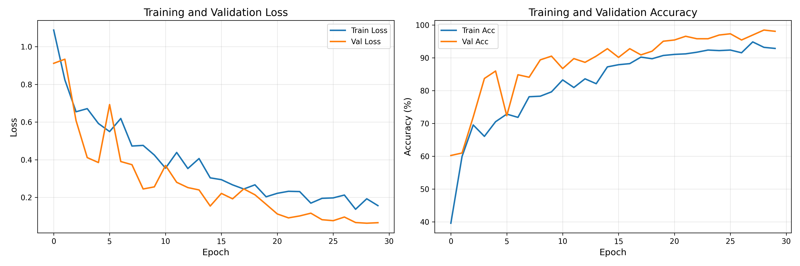
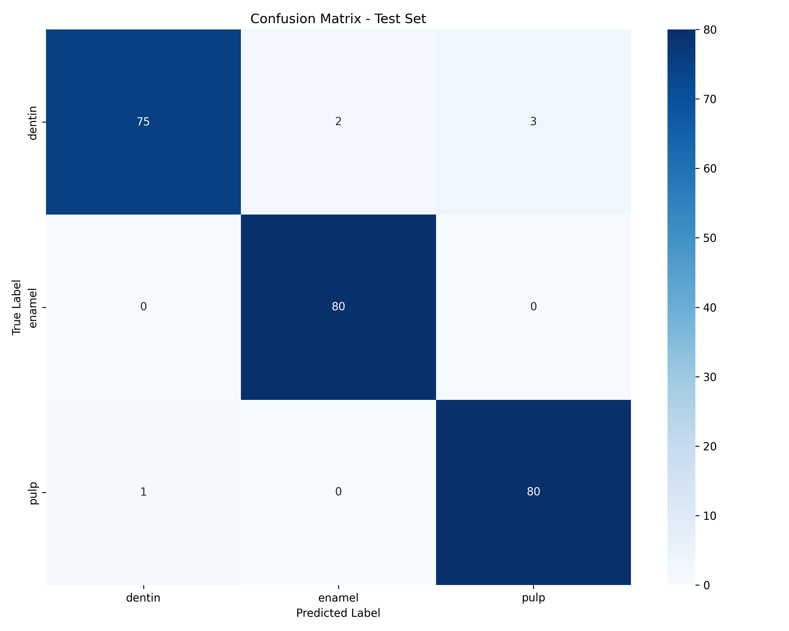

# طبقه‌بندی رادیوگرافی دندانی (DenseNet)

طبقه‌بندی بافت دندان در تصاویر رادیوگرافی به سه کلاس **عاج (dentin)**، **مینا (enamel)** و **پالپ (pulp)** با DenseNet121.

## چه کاری انجام می‌دهد

- آموزش یک طبقه‌بند سه‌کلاسه DenseNet121 روی پچ‌های بخش‌بندی‌شده دندان
- تشخیص با پنجره لغزان روی رادیوگراف کامل
- پیش‌بینی دسته‌ای پوشه‌های تست (`dentin` / `enamel` / `pulp`)
- محاسبه Precision، Recall، Accuracy و F1 از فایل‌های CSV پیش‌بینی

## پیش‌نیازها

- Python 3.10+
- PyTorch با CUDA، Apple MPS یا CPU
- وابستگی‌ها در `requirements.txt`

```bash
python3 -m venv .venv
source .venv/bin/activate
pip install -r requirements.txt
```

## مستندات (Sphinx)

نسخه آنلاین: [مستندات Sphinx (GitHub Pages)](https://thefalcon1977.github.io/dental-radiography-classification/)

ساخت محلی:

```bash
pip install -r docs/requirements.txt
cd docs && make html
# فایل docs/_build/html/index.html را باز کنید
```

## ساختار پروژه

```
densNet/
├── main.py                       # CLI یکپارچه (--train / --predict / …)
├── densnet/                      # کتابخانه مشترک (device، model، predict، …)
├── tests/                        # مجموعه تست pytest
├── requirements.txt
├── requirements-dev.txt          # Commitizen + pre-commit
├── pyproject.toml                # فراداده پروژه + Commitizen
├── .pre-commit-config.yaml       # هوک‌های Git
├── docs/                         # مستندات Sphinx
├── training_history.png          # منحنی‌های loss و accuracy آموزش/اعتبارسنجی
├── confusion_matrix.png          # ماتریس درهم‌ریختگی مجموعه تست
├── slm/                          # چک‌پوینت‌های ذخیره‌شده مدل
├── image-testing/
│   ├── dentin_test/
│   ├── enamel_test/
│   └── pulp_test/
├── segmented_dental_adiography/  # train / valid / test برای آموزش
└── test_predictions/             # خروجی CSV + گزارش ارزیابی
```

## چک‌پوینت مدل

اسکریپت‌های استنتاج از این فایل استفاده می‌کنند:

```text
slm/resolution_best_densenet_model.pth
```

کلاس‌ها (به ترتیب ایندکس): `0 = dentin`، `1 = enamel`، `2 = pulp`.

## آموزش

ساختار دیتاست:

```text
segmented_dental_adiography/
├── train/{dentin,enamel,pulp}/
├── valid/{dentin,enamel,pulp}/
└── test/{dentin,enamel,pulp}/
```

```bash
python main.py --train
```

بهترین چک‌پوینت را ذخیره می‌کند و نمودارهای آموزش و ماتریس درهم‌ریختگی را می‌نویسد:





## تشخیص (تصویر کامل)

اسکن تعاملی با پنجره لغزان و کادرهای رنگی:

- قرمز = عاج (dentin) · سبز = مینا (enamel) · آبی = پالپ (pulp)

```bash
python main.py --detect
# یا: python main.py --detect --image path/to/xray.png
```

## تصاویر تست خارجی (`image-testing/`)

پچ‌های بافتی جدا برای ارزیابی دسته‌ای (متفاوت از `segmented_dental_adiography/` که برای آموزش استفاده می‌شود).

```text
image-testing/
├── dentin_test/   # ۷۵ تصویر — برچسب واقعی: dentin (عاج)
├── enamel_test/   # ۷۵ تصویر — برچسب واقعی: enamel (مینا)
└── pulp_test/     # ۷۵ تصویر — برچسب واقعی: pulp (پالپ)
```

| پوشه | کلاس | تعداد |
|--------|-------|-------|
| `dentin_test/` | dentin (عاج) | ۷۵ |
| `enamel_test/` | enamel (مینا) | ۷۵ |
| `pulp_test/` | pulp (پالپ) | ۷۵ |
| **جمع** | | **۲۲۵** |

فرمت‌های پشتیبانی‌شده: `.png`، `.jpg`، `.jpeg` (با هر حروف بزرگ/کوچک).

## پیش‌بینی دسته‌ای تست

همه تصاویر پوشه متناظر در `image-testing/*_test` را طبقه‌بندی می‌کند و یک CSV در `test_predictions/` می‌نویسد.

ستون‌های CSV (هم‌شکل با خروجی‌های ارزیابی خارجی):

`file,class_name,target,target_label,pred_idx,pred_label,prob_positive`

`prob_positive` احتمال کلاس هدف است (P(dentin)، P(enamel) یا P(pulp)).

```bash
python main.py --predict all
# یا یک کلاس: dentin | enamel | pulp
python main.py --predict dentin
```

خروجی‌ها:

| دستور | ورودی | خروجی |
|--------|-------|--------|
| `--predict dentin` | `image-testing/dentin_test/` | `test_predictions/dentin_test_predictions.csv` |
| `--predict enamel` | `image-testing/enamel_test/` | `test_predictions/enamel_test_predictions.csv` |
| `--predict pulp` | `image-testing/pulp_test/` | `test_predictions/pulp_test_predictions.csv` |

## معیارهای ارزیابی

پس از وجود سه CSV پیش‌بینی:

```bash
python main.py --evaluate
```

از این فرمول‌ها استفاده می‌کند:

| معیار | فرمول |
|--------|---------|
| Precision | TP / (TP + FP) |
| Recall | TP / (TP + FN) |
| Accuracy | (TP + TN) / (TP + TN + FP + FN) |
| F1 | 2 × Precision × Recall / (Precision + Recall) |

خروجی‌ها:

- `test_predictions/evaluation_metrics.csv`
- `test_predictions/evaluation_report.txt`
- همچنین `test_predictions/evaluation_report.md`

### آخرین نتایج تست خارجی (۲۲۵ تصویر)

| کلاس | Precision | Recall | Accuracy | F1 |
|-------|-----------|--------|----------|-----|
| dentin (عاج) | 95.38% | 82.67% | 92.89% | 88.57% |
| enamel (مینا) | 94.87% | 98.67% | 97.78% | 96.73% |
| pulp (پالپ) | 87.80% | 96.00% | 94.22% | 91.72% |
| **macro** | **92.69%** | **92.44%** | **94.96%** | **92.34%** |

**دقت کلی (Overall accuracy):** 92.44%

## گردش کار پیشنهادی

```bash
python main.py --help
python main.py --train
python main.py --predict all
python main.py --evaluate
python main.py --detect --image path/to/xray.png
```

## نکات

- دستگاه به‌صورت خودکار انتخاب می‌شود: CUDA → MPS → CPU
- پیش‌بینی تصاویر `.png` / `.jpg` / `.jpeg` را می‌پذیرد
- اگر چک‌پوینت مدل را عوض کردید، قبل از `--evaluate` دوباره `--predict` را اجرا کنید

## توسعه

Commitizen (`cz commit`)، pre-commit و Ruff را نصب کنید و هوک‌های Git را فعال کنید:

```bash
pip install -r requirements-dev.txt
pre-commit install
```

`pre-commit install` هم هوک `pre-commit` و هم `commit-msg` را ثبت می‌کند (طبق `default_install_hook_types` در `.pre-commit-config.yaml`).

کامیت‌های متعارف را با ویزارد Commitizen بنویسید:

```bash
cz commit
```

هوک‌ها فایل‌های staged را بررسی می‌کنند و پیام‌هایی که از [Conventional Commits](https://www.conventionalcommits.org/) پیروی نکنند رد می‌شوند (`feat`، `fix`، `docs`، `style`، `refactor`، `perf`، `test`، `build`، `ci`، `chore` و …).

لینت و فرمت پایتون با Ruff (از طریق pre-commit هم اجرا می‌شود):

```bash
ruff check .
ruff format
```

اجرای مجموعه تست:

```bash
pytest
```

اجرای همهٔ هوک‌ها روی کل درخت:

```bash
pre-commit run --all-files
```

بالا بردن نسخه و به‌روزرسانی changelog از تاریخچهٔ کامیت‌های متعارف:

```bash
cz bump
```

## مجوز

MIT

---

نسخه انگلیسی: [README.md](README.md)
